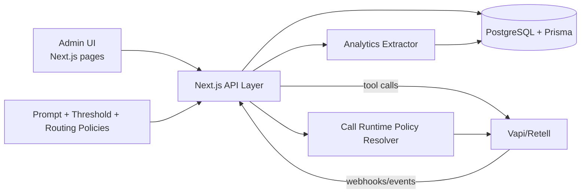

# CareLoop System Design

## 1. Purpose
This document defines the system design for CareLoop as a Dental Practice Management System with:
- Core PMS workflows (patients, appointments, calendar, messaging)
- AI voice automation (scheduling, insurance-aware calls)
- Post-call analytics (sentiment, provider satisfaction, treatment acceptance)
- Runtime settings and policy controls (prompting, thresholds, manual overtake)

It reflects the current codebase and proposes a production-ready target architecture.

## 2. Design Goals
- Keep receptionist and provider workflows fast and reliable.
- Allow AI-first call handling with human override in real time.
- Preserve PHI security and auditability (HIPAA-oriented controls).
- Support near real-time KPI visibility for operations.
- Maintain modularity so voice/analytics can evolve independently.

## 3. Current Stack and Context
- Frontend: Next.js App Router + React + Tailwind + Recharts
- Backend: Next.js API routes (Node runtime)
- DB: PostgreSQL via Prisma
- AI/Voice: Vapi or Retell integration points scaffolded
- Crypto: AES-256-GCM utility for sensitive fields

Relevant implemented domains:
- Voice tool APIs: `app/api/voice/tools/*`
- Voice webhook + KPI extraction: `app/api/voice/webhook/route.ts`
- Settings APIs: `app/api/settings/*`
- Analytics API: `app/api/analytics/overview/route.ts`
- Schema: `prisma/schema.prisma`

## 4. High-Level Architecture

## 5. Bounded Domains

### 5.1 Practice Operations Domain
- Patients and insurance context
- Scheduling and appointment lifecycle
- Provider/room calendars

### 5.2 AI Voice Orchestration Domain
- Call start and call state
- Real-time transcript ingestion
- Barge-in / interruptibility behavior
- Manual overtake controls

### 5.3 Analytics Domain
- Transcript interpretation
- KPI extraction and storage
- Dashboard-focused query model

### 5.4 Configuration and Governance Domain
- Prompt versioning and activation
- Alert thresholds
- AI/manual routing policy by patient type

## 6. Core Data Model
Current logical entities implemented in `prisma/schema.prisma`:
- `Patient`
- `PatientInsurance`
- `Appointment`
- `CallTranscript`
- `CallTranscriptSegment`
- `AnalyticsResult`
- `PracticeKPI`
- `AIPromptVersion`
- `AlertThreshold`
- `RoutingPolicy`

Primary relationships:
- One patient -> many insurance records
- One patient -> many transcripts
- One transcript -> many transcript segments
- One transcript -> one analytics result
- One transcript -> many KPI rows
- One practice -> many prompt versions / routing policies

## 7. Request and Event Flows

### 7.1 AI Call Start
1. UI or automation hits `POST /api/voice/calls/start`
2. API resolves runtime control and system prompt
3. Voice provider call session starts

### 7.2 Real-Time Transcript + Booking Tools
1. Voice runtime requests patient context and availability
2. API reads patient + insurance + busy slots
3. Voice runtime books appointment via tool endpoint
4. Segment endpoint appends transcript chunks

### 7.3 Call Complete -> Analytics
1. Voice provider sends `call.completed` webhook
2. API fetches transcript
3. Analytics extractor computes KPI payload
4. API upserts `AnalyticsResult` and writes `PracticeKPI`
5. Dashboard queries aggregate KPIs via overview endpoint

### 7.4 Manual Overtake
1. Receptionist requests handoff
2. Control API updates call control state machine
3. AI pauses and staff takes over
4. Staff can resume AI or end call

## 8. Runtime Policies
Policy inputs:
- Active prompt version (`AIPromptVersion.isActive`)
- Thresholds (`AlertThreshold`)
- Routing by patient type (`RoutingPolicy`)

Policy outputs:
- Call mode: `ai_only`, `manual_only`, `ai_then_manual`
- Escalation trigger conditions
- Notification channel for low sentiment or treatment decline

## 9. Security, Privacy, and Compliance Design

### 9.1 Implemented Baseline
- Sensitive insurance identifiers are encrypted with AES-256-GCM utility.
- API input validation uses Zod.

### 9.2 Required Additions for Production-Grade HIPAA Posture
- Replace demo header auth with real authN/authZ and role-based enforcement.
- Enforce tenant/practice scoping in all DB reads/writes.
- Verify webhook signatures and prevent replay attacks.
- Add immutable audit logs for PHI access and configuration changes.
- Integrate key management (KMS/HSM) and key rotation policy.
- Define retention and purge policies for transcripts/recordings.
- Add incident alerting and access monitoring.

## 10. Reliability and Scalability

### 10.1 Current constraints
- Manual overtake state is currently in-memory; not safe across restarts or multi-instance.
- Analytics extraction is synchronous in webhook path.

### 10.2 Target approach
- Move call control state to Redis or Postgres-backed coordination table.
- Add queue-based async workers for analytics (BullMQ/SQS/Celery equivalent).
- Add idempotency keys for webhook and booking operations.
- Add distributed tracing and structured logs.

## 11. API Surface (Current + Recommended)

### Voice
- `POST /api/voice/calls/start`
- `POST /api/voice/tools/patient-context`
- `POST /api/voice/tools/calendar-availability`
- `POST /api/voice/tools/create-appointment`
- `POST /api/voice/tools/transcripts/segment`
- `POST /api/voice/tools/transcripts/finalize`
- `POST /api/voice/webhook`
- `POST /api/voice/overtake/control`
- `GET /api/voice/overtake/state/:callId`

### Settings
- `GET/POST/PUT /api/settings/ai-prompt`
- `GET/PUT /api/settings/thresholds`
- `GET/PUT /api/settings/routing-policies`

### Analytics
- `GET /api/analytics/overview?range=7d|30d|90d&practiceId=...`

## 12. Deployment Topology (Recommended)
- Web: Next.js app instances behind load balancer
- DB: Managed PostgreSQL with backups and PITR
- Cache/state: Redis for call control and short-lived runtime state
- Queue: managed queue for post-call analytics jobs
- Object storage: encrypted call recordings/transcript artifacts
- Secrets: managed secret store + KMS

## 13. Observability and SLOs
Core metrics:
- Call turn latency p95
- Appointment booking success rate
- Handoff success rate and time-to-handoff
- Webhook processing failure rate
- KPI extraction job latency and retry counts

Suggested SLOs:
- API availability: 99.9%
- Call tool response p95: < 500 ms
- Webhook ACK p95: < 1 second

## 14. Engineering Roadmap

### Phase 1: Production Readiness
- Implement robust authN/authZ and tenant scoping.
- Add webhook verification and idempotency.
- Add audit_events table and middleware instrumentation.

### Phase 2: Distributed Runtime Safety
- Replace in-memory call state with Redis/Postgres.
- Move analytics to worker queue + retry/dead-letter handling.

### Phase 3: Clinical/Operational Intelligence
- Replace heuristic NLP with model-driven extraction and confidence thresholds.
- Add QA review pipeline for low-confidence or high-risk interactions.

### Phase 4: Compliance Hardening
- Formal retention policy and automated purge jobs.
- Key rotation and periodic access review automation.

## 15. Risks and Mitigations
- Risk: unauthorized PHI access via weak auth
  - Mitigation: enforce JWT/session auth + RBAC + tenant guards
- Risk: duplicate appointment creation from retries
  - Mitigation: idempotency keys and transactional conflict checks
- Risk: lost call control state on restart
  - Mitigation: persistent control state store
- Risk: inaccurate KPI interpretation affecting care ops
  - Mitigation: confidence scoring + human review for low confidence

## 16. Summary
CareLoop has a strong modular foundation for AI-integrated PMS operations. The biggest gap to close is operational and compliance hardening: authentication, webhook trust, distributed state, async processing, and audit controls. Once those are addressed, the architecture can scale safely for real clinical production use.
